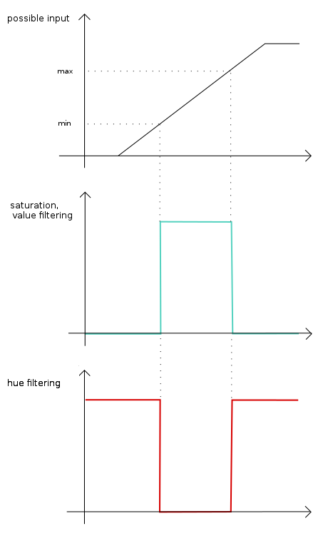

python laser tracker
====================

This is a OpenCV application that applies filters in order to track specific HSV ranges. By default, it tracks a red laser pointer, but it is modular and you can track about whatever you want.

Requirments
-----------

This requires Python2 and the Python wrapper for OpenCV.
It was tested on GNU/Linux distributions and Mac OS X.

Usage
-----
Run ``python laser_tracker/laser_tracker.py -h`` for help on the available command-line parameters.

Range for each HSV components:
    -   hue: [0, 180]
    -   saturation: [0, 255]
    -   value: [0, 255]

About the code
--------------
The code performs the following steps, and displays the results in several windows. The general idea is to:

1. Grab the video frame.
2. Convert it to HSV
3. Split the frame into individual components (separate images for H, S, and V)
4. Apply a threshold to each compenent (hopefully keeping just the dot from the laser)
5. Perform an AND operation on the 3 images (which "should" cut down on false positives)
6. Display the result.

The filtering part is done using successive `thresholding <http://docs.opencv.org/modules/imgproc/doc/miscellaneous_transformations.html?highlight=threshold#threshold>`_

License
-------

This code is MIT-licensed. You can basically do whatever you want with it.

Contributing
------------

Any suggestions, bug reports, or pull requests are welcome! If there's
something I should be doing differently, here, feel free to open an Issue and
let me know.
